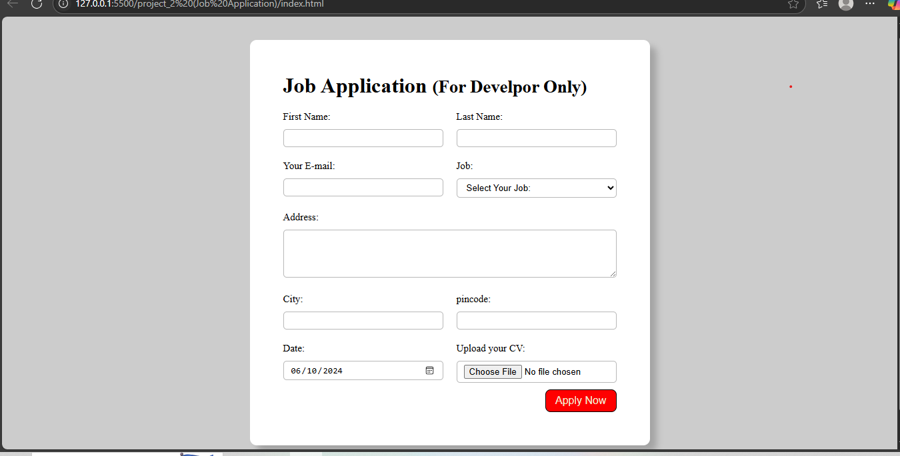

# 📝 Job Application Form (Developer Only)

A clean and responsive job application form built using HTML5 and CSS3 — designed specifically for developer roles like Frontend, Backend, Full Stack, or UI/UX Designer.

## 📸 Preview

 <!-- Replace with your actual screenshot path if available -->

## 🚀 Features

- ✅ Responsive layout using CSS Grid
- 📥 Form includes:
  - First Name, Last Name, Email
  - Role Selection (Frontend, Backend, Full Stack, UI/UX)
  - Address (with textarea)
  - City, Pincode, Date Picker
  - CV File Upload
- 🎨 Styled with modern CSS
- 🧑‍💻 Developer-focused design

## 🛠️ Tech Stack

- **HTML5** – for semantic form structure  
- **CSS3** – for layout, styling, and responsiveness  
- No frameworks or JavaScript — pure front-end

## 📁 Folder Structure
```
job-application/
│
├── index.html # Main form file
├── style.css # Styling for the form
└── README.md # Project documentation
```

## 📦 How to Use

1. **Clone the Repository**
   ```bash
   git clone https://github.com/Sohaibkundi2/job-application.git

2. Open the Project
```
cd job-application
```

3. Run Locally

   - Open index.html in any browser to view the form.

- No build tools or frameworks required.

## Customization
- You can add required attributes for form validation.

- Style enhancements can be added in style.css for animations or dark mode.

- To make it functional, integrate a backend (Node, PHP, etc.) or use Formspree/Netlify Forms.

## 🚧 Future Improvements
- Add form validation (HTML5 or JavaScript)

- Integrate with backend to collect data

- Add success/error messages after submission

- Improve accessibility (ARIA labels, better focus states)

## 🧑 Author
**Sohaib Kundi**
📧 sohaibkundi2@gmail.com
